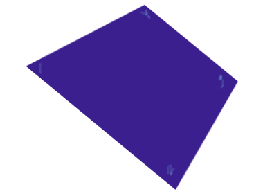
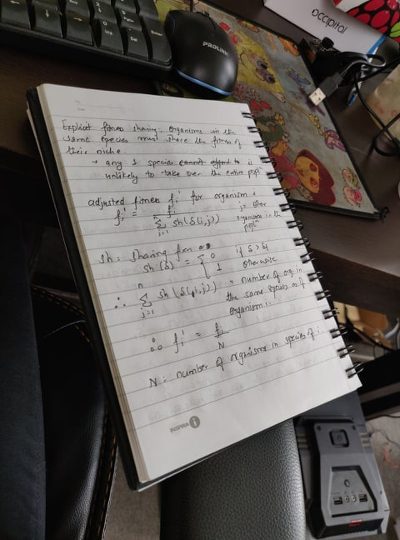
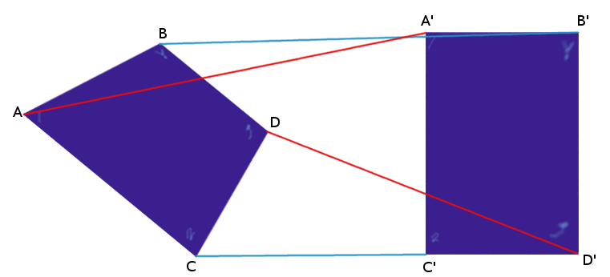
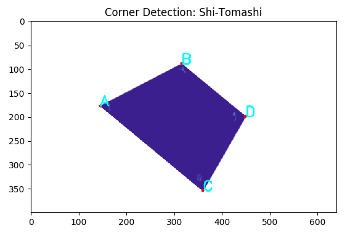
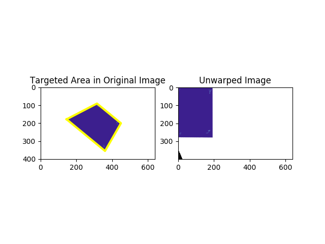
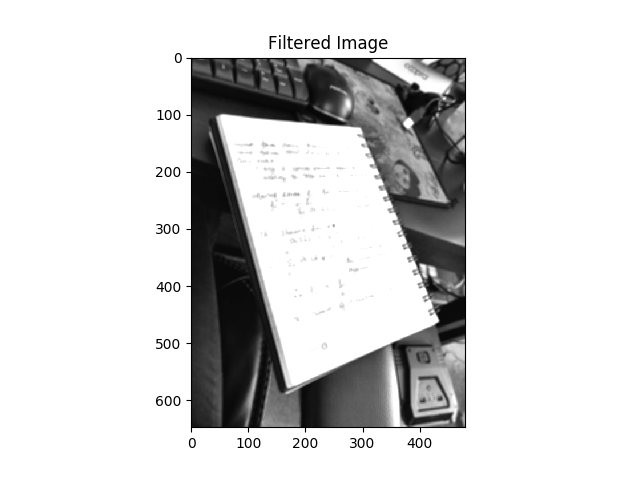
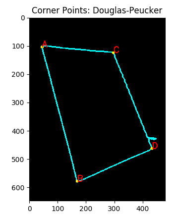
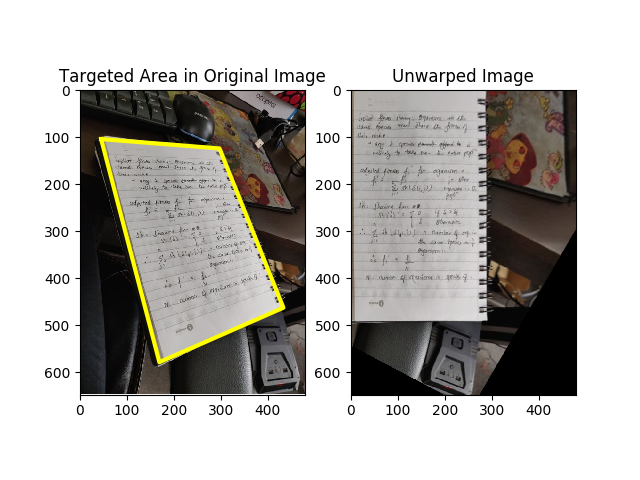

# Skew Correction Using Corner Detectors and Homography

The python file contains a skew corrector for rectangle-like objects. I have used the skew corrector on two types images
- Type 1: smooth with no interfering background (figure 1) 
- Type 2: highly textured but more realistic image (figure 2) 

 
*figure 1*

*figure 2*

## Corner Detectors

I used the following two mechanisms of corner detection on image type 1 and image type 2 respectively
- Shi-tomashi corner detection using `cv2.goodFeaturesToTrack()`
- Contour detection and Douglas-Peucker algorithm using `cv2.findContours()` and `cv2.approxPolyDP()`

## Homography and Image Transformation

- `cv2.findHomography()`
- `cv2.warpPerspective()`

## Results 
  
  

###### For a detailed explanation, refer to my medium article

