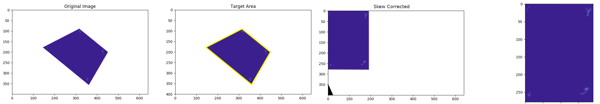
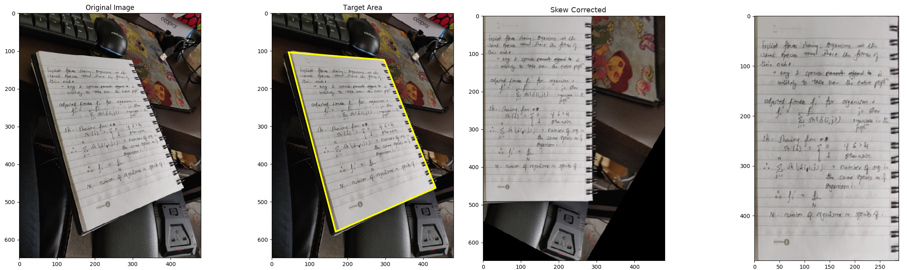

# Automatic Skew Correction Using Corner Detectors and Homography

The python file contains a skew corrector for rectangle-like objects. I have used the skew corrector on two types images
- Type 1: smooth with no interfering background 
- Type 2: highly textured but more realistic image 

## Corner Detectors

I used the following two mechanisms of corner detection on image type 1 and image type 2 respectively
- Shi-tomashi corner detection using `cv2.goodFeaturesToTrack()`
- Contour detection and Douglas-Peucker algorithm using `cv2.findContours()` and `cv2.approxPolyDP()`

## Homography and Image Transformation

- `cv2.findHomography()`
- `cv2.warpPerspective()`

## Results 

### Figure 1
 
### Figure 2

For detailed explanation refer to my Medium blog: https://blog.ekbana.com/skew-correction-using-corner-detectors-and-homography-fda345e42e65

